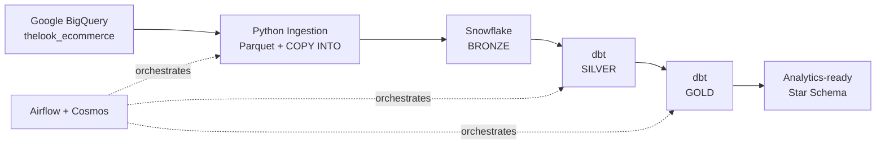
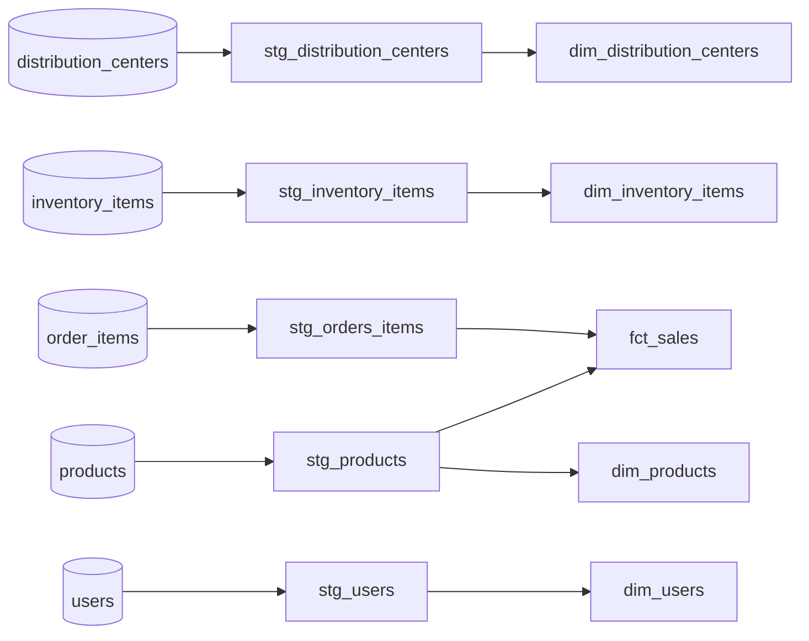

# Data Platform | BigQuery → Snowflake → dbt → Airflow

This project is an end-to-end batch data platform built to practice production-oriented **Data Engineering** patterns.
The pipeline extracts the public `thelook_ecommerce` dataset from **Google BigQuery**, bulk-loads it into **Snowflake**, transforms it through a **Bronze → Silver → Gold** architecture with **dbt**, and orchestrates the complete workflow with **Apache Airflow + Cosmos**.

---
## 1. Architecture

### 1.1. Data Layers
| Layer | Purpose | Materialization |
|---|---|---|
| **Bronze** | Raw source-aligned data | Snowflake tables |
| **Silver** | Cleaned and standardized models | dbt views |
| **Gold** | Analytics-ready dimensional model | dbt tables |
---
## 2. Engineering Highlights

### 2.1. Bulk Ingestion
Instead of row-by-row inserts, the ingestion follows a bulk-load pattern:
```text
BigQuery → Pandas → Parquet → Snowflake Stage → COPY INTO
```
Data is first loaded into a temporary table before replacing the target data, making pipeline reruns **idempotent** and controlling duplicate records.

### 2.2. Independent Orchestration
Airflow generates one ingestion task per configured source table:
```text
ingest_distribution_centers
ingest_inventory_items
ingest_order_items
ingest_products
ingest_users
```
These tasks can execute independently and in parallel, with **2 retries** configured for transient failures.
Only after ingestion completes successfully does the transformation layer begin.

### 2.3. dbt Transformation & Data Quality

The transformation layer follows a medallion architecture.
**Silver** standardizes the raw source data through `stg_*` views and  **Gold** exposes an analytics-ready dimensional model.

Data quality is enforced through dbt tests covering: Primary-key uniqueness and not-null, referential integrity, accepted values, numeric ranges and business rules (eg. non-negative gross profit)

### 2.4. Infrastructure & Security
Snowflake infrastructure is reproducible through versioned SQL scripts covering:
```text
Warehouse → Database → Schemas → Roles → RBAC → Tables
```

---
## 3. Tech Stack
| Component | Technology |
|---|---|
| **Source** | Google BigQuery |
| **Ingestion** | Python · Pandas · PyArrow |
| **Warehouse** | Snowflake |
| **Transformation** | dbt Core · dbt-utils |
| **Orchestration** | Apache Airflow · Astronomer Cosmos |
| **Runtime** | Docker · Astronomer Runtime |
---
## 4. Repository Structure
```text
data-platform/
├── config/             # Central pipeline configuration
├── infrastructure/     # Snowflake provisioning & RBAC
├── ingestion/          # BigQuery → Snowflake ingestion
├── transformation/     # dbt staging, marts, tests & macros
├── orchestration/      # Airflow / Cosmos
└── documentation/      # Architecture & DAG assets
```

---
## 5. Data Model
The Gold layer provides an analytics-ready dimensional model centered on sales.

`fct_sales` contains order-item-level sales information plus some macros calculations (gross_profit, gross_margin).

---

## 6. Run Locally

### 6.1. Provision Snowflake

Run the SQL scripts in `infrastructure/` in order.

### 6.2. Authenticate GCP

```bash
gcloud auth application-default login
```

### 6.3. Configure Environment

Create a `.env` file:

```env
SNOWFLAKE_PASSWORD=<your_password>
```

Update `config/config.py` with your GCP and Snowflake configuration.

### 6.4. Start Airflow

```bash
cd orchestration
astro dev start
```

Open the Airflow UI and trigger `dataplatform_pipeline`.

### 6.5. Teardown

Run `infrastructure/999_destroy.sql` to remove the Snowflake resources.
