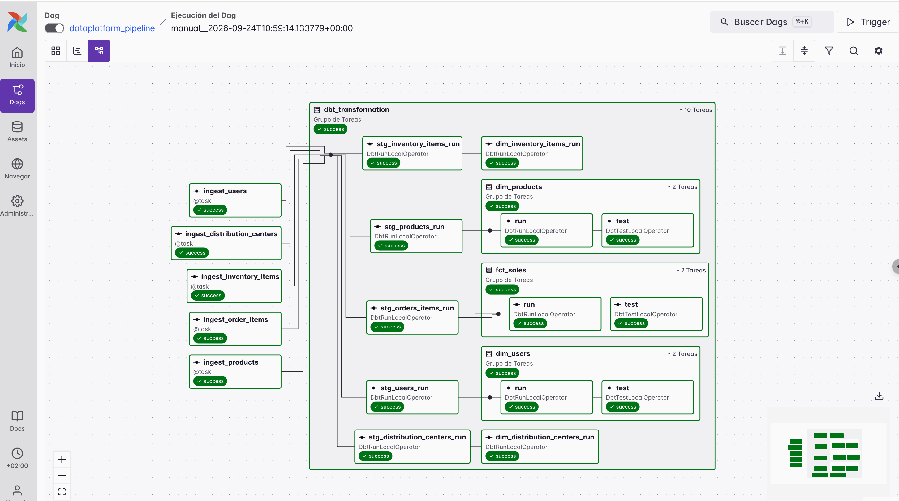
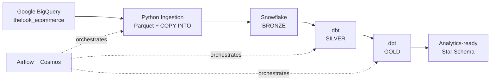
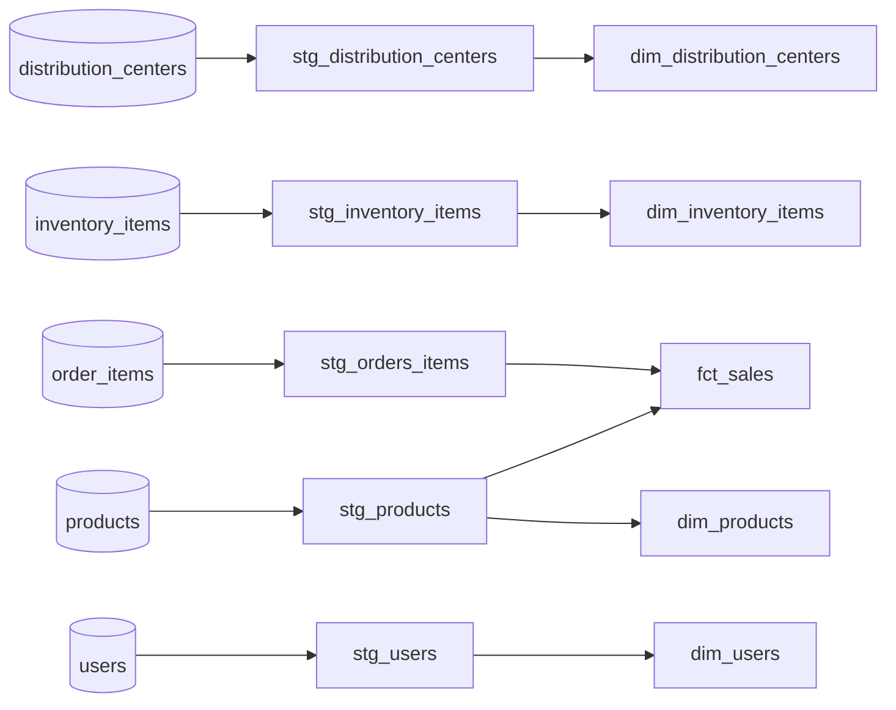

Absolutely — here is the complete copy-paste-ready README.md:

# Data Platform | BigQuery → Snowflake → dbt → Airflow
An end-to-end batch data platform built to practice production-oriented **Data Engineering** patterns.
The pipeline extracts the public `thelook_ecommerce` dataset from **Google BigQuery**, bulk-loads it into **Snowflake**, transforms it through a **Bronze → Silver → Gold** architecture with **dbt**, and orchestrates the complete workflow with **Apache Airflow + Cosmos**.

---
## Architecture

### Data Layers
| Layer | Purpose | Materialization |
|---|---|---|
| **Bronze** | Raw source-aligned data | Snowflake tables |
| **Silver** | Cleaned and standardized models | dbt views |
| **Gold** | Analytics-ready dimensional model | dbt tables |
---
## Engineering Highlights
### Idempotent Bulk Ingestion
Each BigQuery table is processed as an independent Airflow task.
Instead of row-by-row inserts, the ingestion follows a bulk-load pattern:
```text
BigQuery → Pandas → Parquet → Snowflake Stage → COPY INTO
```
Data is first loaded into a temporary table before replacing the target data, making pipeline reruns **idempotent** and preventing duplicate records.
The same ingestion implementation is reused across all source tables.
### Independent Orchestration
Airflow generates one ingestion task per configured source table:
```text
ingest_distribution_centers
ingest_inventory_items
ingest_order_items
ingest_products
ingest_users
```
These tasks can execute independently and in parallel, with **2 retries** configured for transient failures.
Only after ingestion completes successfully does the transformation layer begin.
**Cosmos** translates the dbt dependency graph into native Airflow tasks, exposing individual models and tests directly in the DAG.
### dbt Transformation & Data Quality
The transformation layer follows a medallion architecture.
**Silver** standardizes the raw source data through `stg_*` views.
**Gold** exposes an analytics-ready dimensional model:
- `fct_sales`
- `dim_products`
- `dim_users`
- `dim_inventory_items`
- `dim_distribution_centers`
Data quality is enforced through dbt tests covering:
- primary-key uniqueness and nullability
- referential integrity
- accepted values
- numeric ranges
- business rules such as non-negative gross profit
### Infrastructure & Security
Snowflake infrastructure is reproducible through versioned SQL scripts covering:
```text
Warehouse → Database → Schemas → Roles → RBAC → Tables
```
The project uses:
- a dedicated `ROLE_DEV`
- environment-based secrets
- least-privilege Snowflake access
- a dedicated dbt virtual environment inside the Airflow container
- Docker for reproducible local execution
---
## Tech Stack
| Component | Technology |
|---|---|
| **Source** | Google BigQuery |
| **Ingestion** | Python · Pandas · PyArrow |
| **Warehouse** | Snowflake |
| **Transformation** | dbt Core · dbt-utils |
| **Orchestration** | Apache Airflow · Astronomer Cosmos |
| **Runtime** | Docker · Astronomer Runtime |
---
## Repository Structure
```text
data-platform/
├── config/             # Central pipeline configuration
├── infrastructure/     # Snowflake provisioning & RBAC
├── ingestion/          # BigQuery → Snowflake ingestion
├── transformation/     # dbt staging, marts, tests & macros
├── orchestration/      # Airflow / Cosmos
└── documentation/      # Architecture & DAG assets
```
The main responsibilities are deliberately separated:
```text
config/
    Defines what the pipeline processes
ingestion/
    Defines how data moves from BigQuery → Snowflake
transformation/
    Defines how Bronze data becomes analytics-ready models
orchestration/
    Defines when and in what order workloads execute
infrastructure/
    Defines the Snowflake environment
```
---
## Pipeline Execution
The complete DAG executes:
```text
BigQuery
   │
   ├── ingest_distribution_centers ─┐
   ├── ingest_inventory_items ──────┤
   ├── ingest_order_items ──────────┼──► dbt SILVER ──► dbt GOLD ──► tests
   ├── ingest_products ─────────────┤
   └── ingest_users ────────────────┘
```
The ingestion task list is driven by central configuration rather than duplicated inside the DAG.
Each task calls the same reusable `ingest_table()` implementation while remaining independently observable and retryable in Airflow.
Once all ingestion tasks succeed, Cosmos executes the dbt dependency graph.

---
## Data Model
The Gold layer provides an analytics-ready dimensional model centered on sales.

`fct_sales` contains order-item-level sales information including pricing, cost and profitability metrics.
Reusable dbt macros calculate measures such as:
```text
gross_profit = sale_price - cost
gross_margin = gross_profit / sale_price
```
---
## Data Quality
Testing is integrated directly into the transformation workflow.
### Source Tests
Bronze source definitions validate:
- primary keys
- nullability
- relationships between source entities
### Model Tests
Gold models validate:
- unique and non-null keys
- relationships between facts and dimensions
- accepted order statuses
- valid numeric ranges
### Business Rule Tests
Custom singular tests validate business-specific expectations such as:
```text
gross_profit >= 0
```
Because Cosmos exposes dbt tests as Airflow tasks, transformation and validation are visible in the same operational DAG.
---
## Run Locally
### 1. Provision Snowflake
Run the versioned SQL scripts under:
```text
infrastructure/
```
They create the warehouse, database, schemas, roles, permissions and Bronze tables.
### 2. Authenticate GCP
Create Google Application Default Credentials:
```bash
gcloud auth application-default login
```
The local credentials are mounted read-only into the Airflow environment.
### 3. Configure Secrets
Create the required `.env` file:
```env
SNOWFLAKE_PASSWORD=<your_password>
```
Secrets are excluded from version control.
Update `config/config.py` with the required GCP and Snowflake environment configuration.
### 4. Start Airflow
```bash
cd orchestration
astro dev start
```
Open the Airflow UI and trigger:
```text
dataplatform_pipeline
```
### 5. Teardown
The infrastructure directory includes a teardown script for removing the development Snowflake resources when they are no longer required.
---
## Design Scope
This first version intentionally uses **batch processing and full-refresh ingestion**.
The goal was not to maximize the number of technologies in the stack, but to build a reliable end-to-end foundation covering:
- bulk data ingestion
- idempotent reruns
- independent task execution
- orchestration and retries
- warehouse modeling
- data quality
- RBAC
- reproducible infrastructure
For larger datasets or stricter freshness requirements, natural next steps would include **incremental loading, watermarking / MERGE strategies, and CDC**.
---
## Result
The final pipeline successfully executes the complete path:
```text
Google BigQuery
      ↓
Python Bulk Ingestion
      ↓
Snowflake BRONZE
      ↓
dbt SILVER
      ↓
dbt GOLD
      ↓
Data Quality Tests
```
All stages are orchestrated and observable through a single Airflow DAG.
