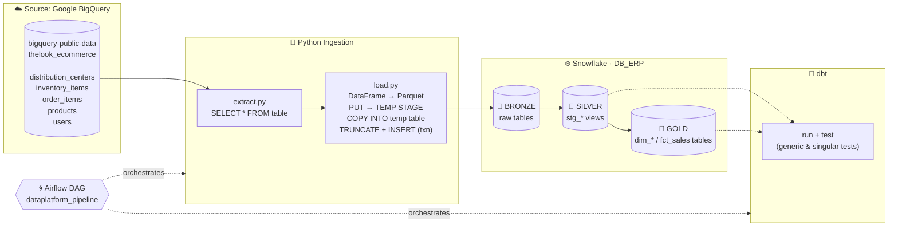
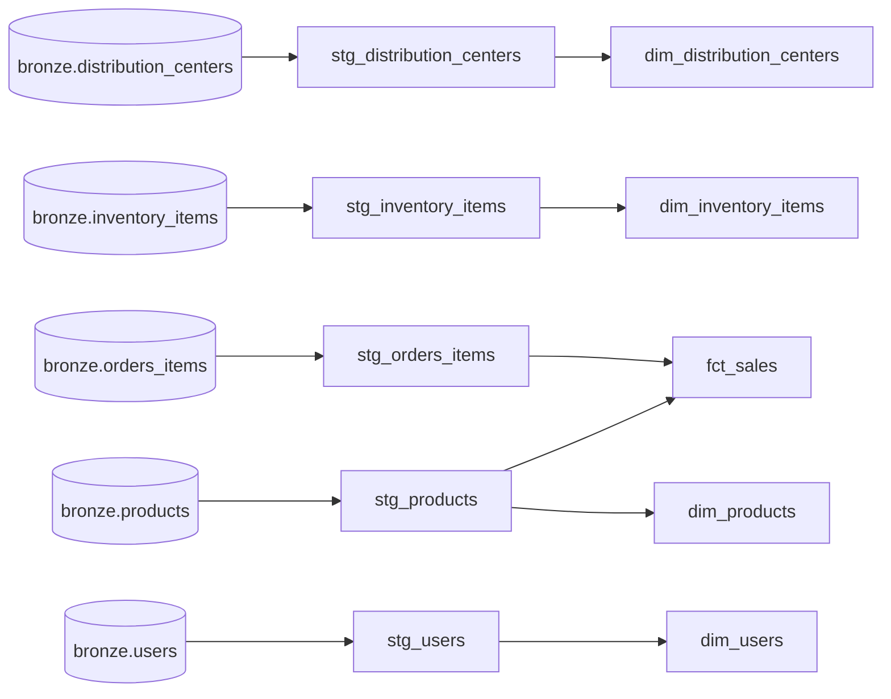

# Data Platform Batch Processing

This project is an end-to-end **ELT data platform** that pulls the public `thelook_ecommerce` dataset from **Google BigQuery** and loads it into **Snowflake**. From there it models the data with **dbt** into a **Bronze → Silver → Gold** medallion architecture. **Apache Airflow** (Astronomer Runtime + Cosmos) orchestrates the whole cycle.


---

## Architecture



| Layer | Schema | Materialization | Built by |
|---|---|---|---|
| 🥉 **Bronze** | `DB_ERP.BRONZE` | Tables (raw copy of the source) | Python ingestion |
| 🥈 **Silver** | `DB_ERP.SILVER` | Views (cleaned & renamed) | dbt `staging/` |
| 🥇 **Gold** | `DB_ERP.GOLD` | Tables (dimensional model) | dbt `marts/` |

---

## Tech Stack

| Component | Technology |
|---|---|
| Source | Google BigQuery (`bigquery-public-data.thelook_ecommerce`) |
| Ingestion | Python · `google-cloud-bigquery` · `pandas` · `pyarrow` (Parquet) · `snowflake-connector-python` |
| Warehouse | Snowflake (x-small warehouse, RBAC) |
| Transformation | dbt Core · `dbt-snowflake` · `dbt_utils` 1.1.1 |
| Orchestration | Apache Airflow 3 on Astronomer Runtime 3.3 · `astronomer-cosmos` |
| Runtime | Docker (Astro CLI) |

---

## 📁 Repository Structure

```
data-platform/
├── config/
│   └── config.py                 # Central config: BigQuery source, Snowflake target, table list
├── infrastructure/               # Snowflake setup scripts (run in order)
│   ├── 001_create_warehouse.sql
│   ├── 002_create_database.sql
│   ├── 003_create_schemas.sql
│   ├── 004_create_roles.sql
│   ├── 005_rbac.sql
│   ├── 006_create_tables.sql
│   └── 999_destroy.sql           # Teardown
├── ingestion/
│   └── bigquery/
│       ├── extract.py            # BigQuery extraction
│       ├── load.py               # Snowflake bulk load
│       └── run.py                # ingest_table() = extract + load
├── transformation/
│   └── transformation_dbt/       # dbt project
│       ├── models/
│       │   ├── staging/          # sources.yml + stg_* views  (SILVER)
│       │   └── marts/            # dim_* + fct_sales tables   (GOLD) + generic tests
│       ├── macros/               # generate_schema_name, profitability
│       ├── tests/                # singular tests
│       └── packages.yml          # dbt_utils
├── orchestration/                # Astro / Airflow project
│   ├── dags/dataplatform_pipeline.py
│   ├── dbt/profiles.yml
│   ├── Dockerfile
│   ├── docker-compose.override.yml
│   └── requirements.txt
└── documentation/
    └── DAG_complete_cycle.png
```

---

## 🔄 The Pipeline, Step by Step

### 1️⃣ Infrastructure: Snowflake setup

The SQL scripts in [`infrastructure/`](infrastructure/) build the whole Snowflake environment. They are idempotent (`IF NOT EXISTS`):

| Script | What it does |
|---|---|
| `001_create_warehouse.sql` | Creates `DEV_WH`: **x-small**, `auto_suspend = 60`, `auto_resume = true` (cost-efficient) |
| `002_create_database.sql` | Creates database `DB_ERP` |
| `003_create_schemas.sql` | Creates the medallion schemas `BRONZE`, `SILVER`, `GOLD` |
| `004_create_roles.sql` | Creates the `ROLE_DEV` role |
| `005_rbac.sql` | Grants least-privilege access: warehouse usage, database/schema usage, and `CREATE TABLE/VIEW` per schema, then assigns the role to the user |
| `006_create_tables.sql` | Creates the 5 Bronze tables with typed columns (`TIMESTAMP_TZ`, `GEOGRAPHY`, …) |
| `999_destroy.sql` | Drops database, warehouse and role (full teardown) |

### 2️⃣ Ingestion: BigQuery ➜ Snowflake Bronze

All sources and targets are defined in [`config/config.py`](config/config.py):

```python
BIGQUERY_SOURCE_PROJECT = "bigquery-public-data"
BIGQUERY_DATASET        = "thelook_ecommerce"
BIGQUERY_TABLES = ["distribution_centers", "inventory_items", "order_items", "products", "users"]
```

**Extract** ([`extract.py`](ingestion/bigquery/extract.py)) queries each table from BigQuery. It supports an optional `start_date` parameter for incremental extraction, passed safely as a query parameter.

**Load** ([`load.py`](ingestion/bigquery/load.py)) is a bulk-load pattern built for speed and safety:

1. Converts the BigQuery rows to a **pandas DataFrame**.
2. Serializes geospatial objects to **WKT**.
3. Writes the DataFrame to a local **Parquet** file.
4. Creates a **temporary stage** and a **temporary table** (`LIKE` the target) and runs `PUT` to upload the file.
5. Runs `COPY INTO` the temp table, casting `*_geom` columns with `TO_GEOGRAPHY(...)`.
6. In a **single transaction**, runs `TRUNCATE` on the target and `INSERT … SELECT` from the temp table.
7. On any error it runs `ROLLBACK`, so the Bronze table is never left half-loaded.

**Run** ([`run.py`](ingestion/bigquery/run.py)): `ingest_table(table)` wraps extract + load in a single call. Airflow calls this function.

### 3️⃣ Transformation: dbt (Silver & Gold)

The dbt project is [`transformation/transformation_dbt`](transformation/transformation_dbt/).

A custom **`generate_schema_name`** macro makes models land exactly in `SILVER` / `GOLD`, without dbt's default `<target>_<schema>` prefix.

#### 🥈 Staging layer (`SILVER`, views)

These views rename the source primary keys to explicit business keys and standardize column names.

| Model | Source (Bronze) | Key change |
|---|---|---|
| `stg_distribution_centers` | `distribution_centers` | `id → distribution_center_id`, `name → distribution_center_name` |
| `stg_inventory_items` | `inventory_items` | `id → inventory_item_id`, `product_distribution_center_id → distribution_center_id` |
| `stg_orders_items` | `orders_items` | `id → order_item_id` |
| `stg_products` | `products` | `id → product_id`, `name → product_name` |
| `stg_users` | `users` | `id → user_id` |

#### 🥇 Marts layer (`GOLD`, tables)

These tables form a **star schema** ready for analytics:

| Model | Type | Highlights |
|---|---|---|
| `fct_sales` | Fact | One row per order item. Surrogate key `sales_key` (`dbt_utils.generate_surrogate_key`), order lifecycle timestamps, `sale_price`, `cost`, **`gross_profit`**, **`gross_margin`** |
| `dim_products` | Dimension | Product master. `product_name` falls back to `'Unknown'` |
| `dim_users` | Dimension | Customer demographics, location and `traffic_source` |
| `dim_inventory_items` | Dimension | Inventory with a derived **`inventory_status`** (`sold` / `available`) |
| `dim_distribution_centers` | Dimension | Distribution centers with geography |

The profitability logic is reusable through macros ([`macros/profitability.sql`](transformation/transformation_dbt/macros/profitability.sql)):

```sql
 ({{ sale_price }} - {{ cost }}) 
 ({{ sale_price }} - {{ cost }}) / {{ sale_price }} 
```

#### 🧬 Model lineage



### 4️⃣ Data Quality: dbt tests

Tests run at **every layer**:

| Level | Tests |
|---|---|
| **Sources** (`sources.yml`) | `unique` + `not_null` on primary keys. `relationships` between orders ↔ users/products/inventory and inventory ↔ distribution centers |
| **Marts** (`generic_test.yml`) | `fct_sales`: `unique`/`not_null` on `sales_key` & `order_item_id`, referential integrity to `dim_products` & `dim_users`, `dbt_utils.accepted_range` (> 0) on `sale_price` & `cost`, and `accepted_values` on `order_status` (`Complete`, `Shipped`, `Processing`, `Cancelled`, `Returned`). `dim_products` / `dim_users`: unique, non-null keys |
| **Singular** (`tests/`) | `assert_no_negative_gross_profit`: fails if any sale has `gross_profit < 0` |

### 5️⃣ Orchestration: Airflow + Cosmos

The DAG [`dataplatform_pipeline`](orchestration/dags/dataplatform_pipeline.py) ties everything together:

```python
ingestion_tasks = [
    ingest.override(task_id=f"ingest_{table}")(table)
    for table in BIGQUERY_TABLES
]

dbt_transformation = DbtTaskGroup(group_id="dbt_transformation", ...)

ingestion_tasks >> dbt_transformation
```

- **Dynamic ingestion tasks.** One `ingest_<table>` task is generated per table in `BIGQUERY_TABLES`, and they run in parallel.
- **Cosmos `DbtTaskGroup`.** It renders the dbt project as native Airflow tasks: each staging model becomes a `DbtRunLocalOperator`, and each tested mart becomes a **run → test** sub-group.
- **Resilience.** `retries = 2` with a `retry_delay` of 2 minutes. `catchup=False`. The DAG is triggered manually (`schedule=None`).
- **Isolated dbt runtime.** The [`Dockerfile`](orchestration/Dockerfile) installs `dbt-snowflake` in a dedicated virtualenv (`/usr/local/airflow/dbt_venv`) to avoid dependency conflicts with Airflow.
- **Mounted code.** [`docker-compose.override.yml`](orchestration/docker-compose.override.yml) mounts `ingestion/`, `config/`, the dbt project, `profiles.yml` and the GCP application-default credentials into the Airflow containers, so there is one source of truth for all code.

---

## 🚀 Getting Started

### Prerequisites

- A Snowflake account with `ACCOUNTADMIN` access (for the initial setup)
- A Google Cloud project with the BigQuery API enabled
- [Docker](https://www.docker.com/) and the [Astro CLI](https://www.astronomer.io/docs/astro/cli/overview)
- `gcloud` CLI

### 1. Provision Snowflake

Run the scripts in [`infrastructure/`](infrastructure/) **in order** (`001` → `006`) in a Snowflake worksheet.

### 2. Configure credentials

```bash
# GCP: creates ~/.config/gcloud/application_default_credentials.json (mounted into Airflow)
gcloud auth application-default login
```

Create a `.env` file with your Snowflake password (it is git-ignored):

```env
SNOWFLAKE_PASSWORD=<your_password>
```

Update [`config/config.py`](config/config.py) with your GCP project and Snowflake account/user. Then update [`orchestration/dbt/profiles.yml`](orchestration/dbt/profiles.yml) for dbt:

```yaml
transformation_dbt:
  outputs:
    dev:
      type: snowflake
      account: <your_account>
      user: <your_user>
      password: <your_password>
      role: ROLE_DEV
      database: DB_ERP
      warehouse: DEV_WH
      schema: BRONZE
      threads: 1
  target: dev
```

### 3. Start Airflow

```bash
cd orchestration
astro dev start
```

Open the Airflow UI at http://localhost:8080 and **trigger `dataplatform_pipeline`**.

### 4. Teardown

Run [`infrastructure/999_destroy.sql`](infrastructure/999_destroy.sql) to drop the database, the warehouse and the role.

---

## ✅ Final Result

Here is a complete, successful run of the pipeline in the Airflow UI:


What the graph shows:

1. **5 ingestion tasks** (`ingest_users`, `ingest_distribution_centers`, `ingest_inventory_items`, `ingest_order_items`, `ingest_products`) load BigQuery data into Snowflake **Bronze** in parallel.
2. When all of them succeed, the **`dbt_transformation`** task group starts:
   - **Staging runs** (`stg_*_run`) build the **Silver** views.
   - **Mart runs** build the **Gold** tables. The tested models (`dim_products`, `fct_sales`, `dim_users`) run as **run → test** sub-groups, so data quality is checked right after each model is built.
3. Every task finishes in **`success`**. The data goes from the raw public dataset to an analytics-ready, tested star schema in one orchestrated run.
